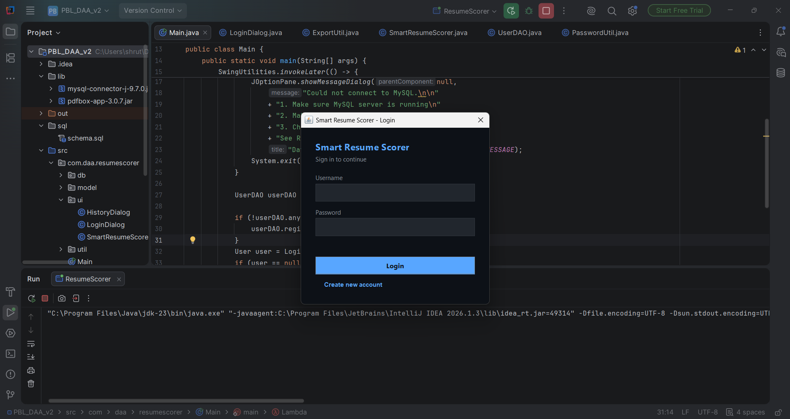
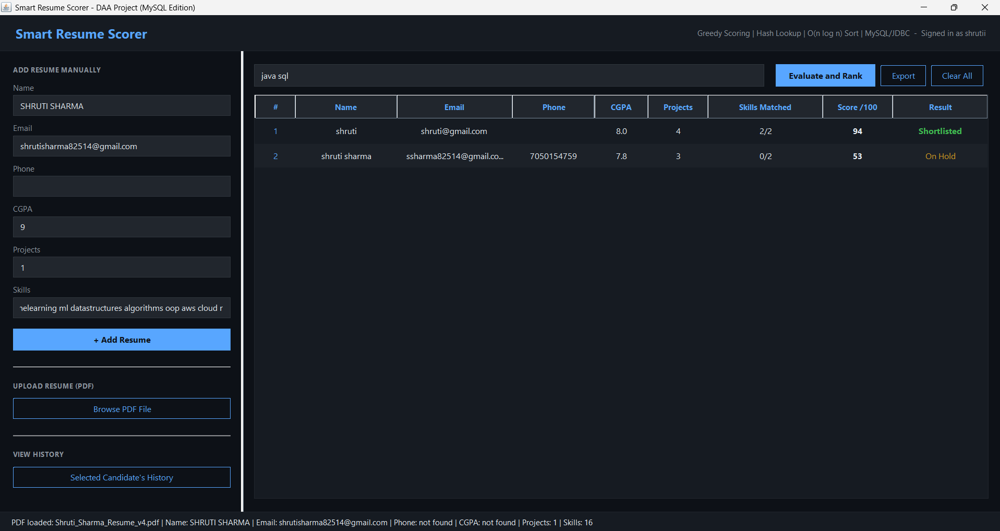

# Smart Resume Scorer — MySQL / JDBC Edition

A Java Swing desktop app that scores and ranks resumes against a job's
required skills, with login, MySQL persistence, evaluation history, and
CSV/PDF export.

## What changed from the original version

| Before | Now |
|---|---|
| Single 600-line `.java` file | Layered packages: `model`, `db`, `util`, `ui` |
| Data saved to `resumes.txt` | Data saved in a normalized MySQL database |
| No login | Login / Register screen (passwords hashed, never stored in plain text) |
| No history | Every "Evaluate & Rank" run is saved to an `evaluations` table |
| No export | Export ranked results to CSV (Excel) or a PDF report |

The core algorithm (DAA part of the project) is untouched: skill matching
still uses a `HashSet` for O(1) lookups, and ranking still uses `List.sort`
(O(n log n)).

## Project structure

```
PBL_DAA_v2/
├── src/com/daa/resumescorer/
│   ├── Main.java                  entry point
│   ├── model/                     Candidate, User (plain data objects)
│   ├── db/                        DBConnection, CandidateDAO, SkillDAO,
│   │                              UserDAO, EvaluationDAO  (all JDBC code)
│   ├── util/                      PdfParser, PasswordUtil, ExportUtil
│   └── ui/                        LoginDialog, HistoryDialog, SmartResumeScorer
├── sql/schema.sql                 run this once to create the database
├── db.properties                  your MySQL url / username / password
├── lib/                           pdfbox-app-3.0.7.jar (mysql connector goes here too)
├── compile.sh / compile.bat
└── run.sh / run.bat
```

## 1. Install MySQL (since you said it isn't set up yet)

**Windows:** download the MySQL Installer from
https://dev.mysql.com/downloads/installer/ and run it (pick "Server only" —
you don't need Workbench unless you want a GUI). During setup it will ask
you to set a **root password** — remember it, you'll need it below.

**macOS:** `brew install mysql` then `brew services start mysql`

**Linux (Debian/Ubuntu):**
```
sudo apt update
sudo apt install mysql-server
sudo service mysql start
sudo mysql_secure_installation   # sets a root password
```

Check it's running:
```
mysql -u root -p
```
If that opens a `mysql>` prompt, you're good — type `exit` to leave.

## 2. Create the database and tables

From a terminal, in this project folder:
```
mysql -u root -p < sql/schema.sql
```
This creates the `resume_scorer_db` database with 5 tables: `users`,
`candidates`, `skills`, `candidate_skills` (many-to-many bridge), and
`evaluations` (history log).

## 3. Download the MySQL JDBC driver

Download **mysql-connector-j** (the `.jar`, "Platform Independent" ZIP) from:
https://dev.mysql.com/downloads/connector/j/

Unzip it and copy `mysql-connector-j-9.x.x.jar` into this project's `lib/`
folder, next to `pdfbox-app-3.0.7.jar`. The `lib/` folder should then have
both jars.

## 4. Configure your password

Open `db.properties` and replace `YOUR_MYSQL_PASSWORD_HERE` with your
actual MySQL root password (the one you set in step 1):
```
db.url=jdbc:mysql://localhost:3306/resume_scorer_db?useSSL=false&allowPublicKeyRetrieval=true&serverTimezone=UTC
db.user=root
db.password=your_actual_password
```

## 5. Compile and run

**Windows:**
```
compile.bat
run.bat
```

**macOS / Linux:**
```
./compile.sh
./run.sh
```

On first launch you'll see a login screen — click **"Create new account"**
to register a username/password, then log in.

## Using the app

1. **Add Resume Manually** or **Browse PDF File** to add a candidate — saved
   straight to MySQL.
2. Type the job's required skills, click **Evaluate and Rank** — scores are
   computed and the run is logged to the `evaluations` table.
3. Select a row and click **Selected Candidate's History** to see every past
   evaluation for that person.
4. Click **Export** to save the ranked list as a CSV (opens in Excel) or a
   PDF report.

## Talking about this on your resume

You can honestly describe this project as:
- Built a Java Swing desktop application with a normalized MySQL schema
  (3NF, many-to-many skill mapping) accessed via JDBC, including prepared
  statements and transaction handling.
- Implemented user authentication with salted password hashing.
- Used hash-based set lookups for O(1) skill matching and `List.sort` for
  O(n log n) candidate ranking.
- Added PDF parsing (Apache PDFBox) and CSV/PDF report export features.

- ## 📸 Application Screenshots

### Login Screen



### Dashboard



### Resume Evaluation


---

## 🚀 Future Enhancements

- AI-powered Resume Analysis using NLP
- ATS Compatibility Checker
- Resume Keyword Suggestions
- AI-based Interview Question Generator
- Recruiter Dashboard
- Skill Gap Analysis
- Resume Feedback using LLMs
- Cloud Deployment (AWS)
- Email Notification System
- REST API Integration

## Troubleshooting

- **"Could not connect to MySQL"** on launch → MySQL isn't running, or
  `db.properties` has the wrong password. Run `mysql -u root -p` to confirm
  your credentials work first.
- **`ClassNotFoundException: com.mysql.cj.jdbc.Driver`** → the connector jar
  isn't in `lib/`, or you compiled/ran without `lib/*` on the classpath.
- **Login screen never appears / app exits immediately** → check the
  terminal output, it will print the exact JDBC error.
